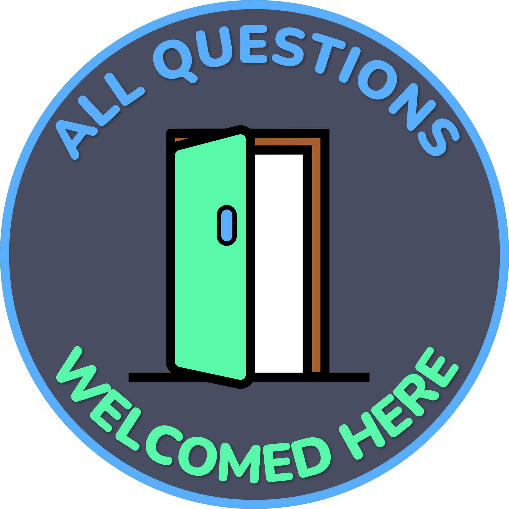
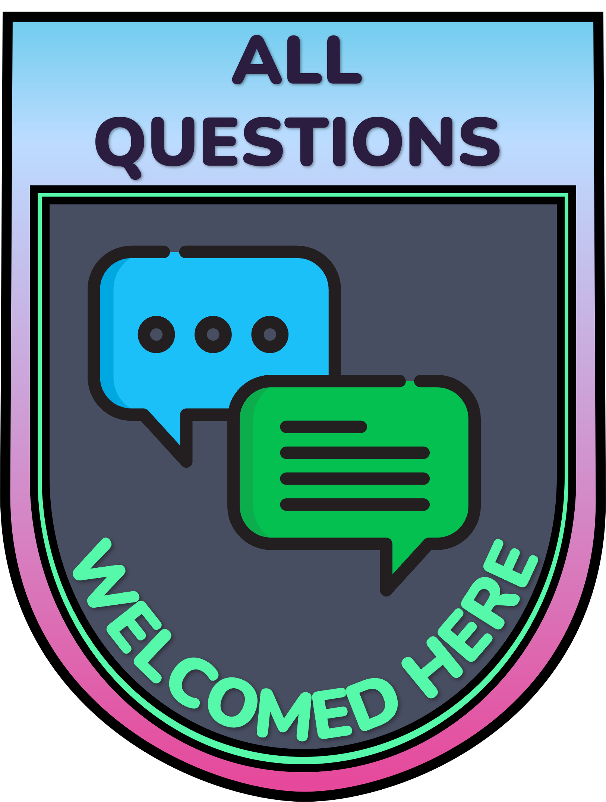
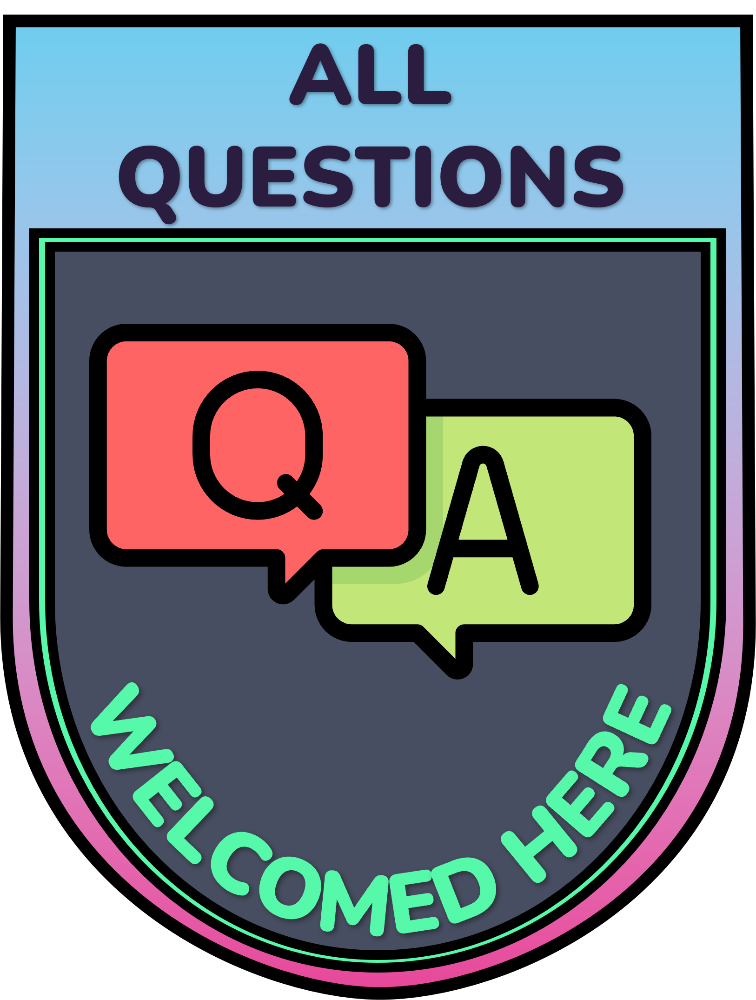

# AQW: All Questions Welcomed
Encourage engagement and questions of all levels in your projects.

## Purpose
The goal of this project is to establish a set of unique, recognisable icons/badges that you can add to your project pages/readmes. These badges signal to users that you welcome questions and engagement, regardless of their experience level.

While having a public GitHub repository generally implies openness to community engagement, many users may hesitate to ask questions out of an unfounded fear that their questions might be perceived as "stupid". We believe that no question is a stupid question.

By displaying this badge, authors and maintainers indicate that they are happy to receive questions and feedback about their respective projects without judgement.

## Initial Designs
Below are a few initial designs. These are not final and, as a community project, we encourage feedback, suggestions, and alternative designs from others. You can contribute by submitting an issue or a pull request.

To differentiate these badges from the commonly used hexagon stickers in other projects, we have chosen not to use a hexagon shape. Although this project was initially designed with R packages in mind, it is not limited to them and is encouraged for use across all programming languages and repositories.

### Badge Designs

**Design 1:**  

**Design 2:**  

**Design 3:**  

## To-Do
Add [Shields.io](https://shields.io/) Badge: Explore creating a static badge on Shields.io for users to easily integrate into their projects. This would provide a an additional standardised way for projects to display their openness to questions and engagement.

## Contributing
We welcome contributions from the community. If you have suggestions for new designs or improvements to existing ones, please feel free to create an issue or a pull request. Together, we can create a more inclusive and engaging open-source community.

---

We hope these badges help foster an environment where everyone feels comfortable asking questions and contributing, regardless of their skill level. Let's make open source more welcoming for everyone!
